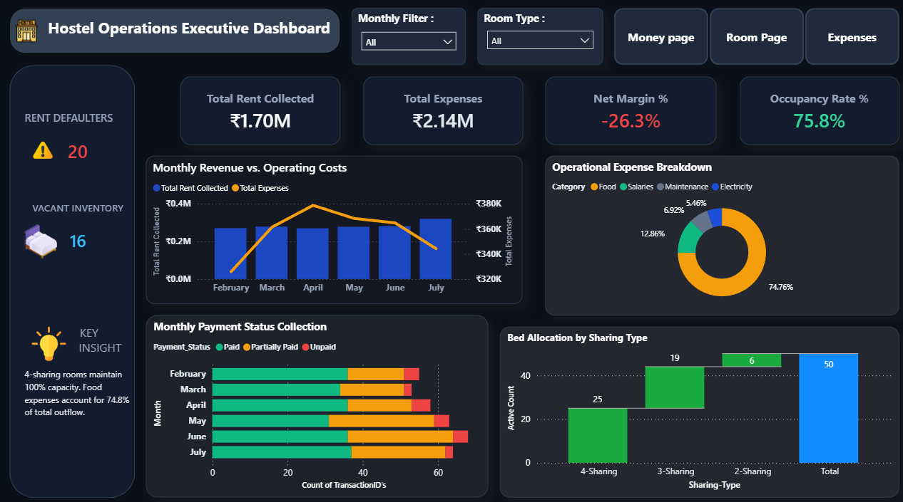
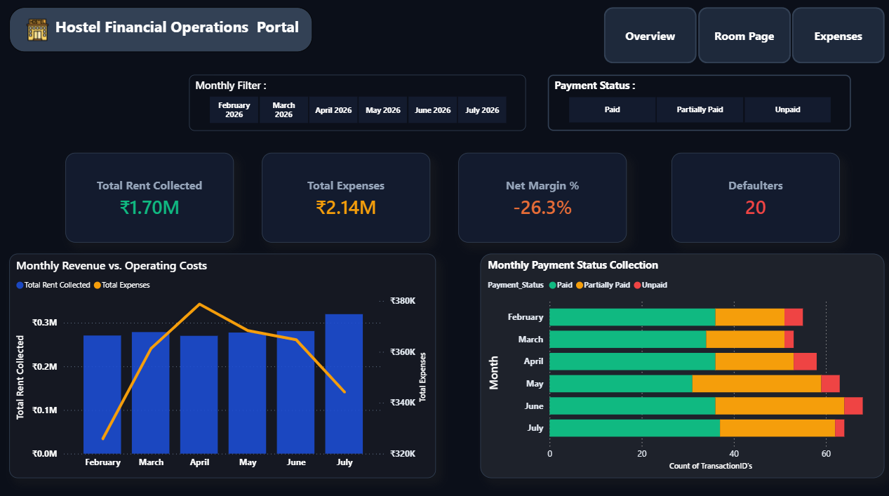
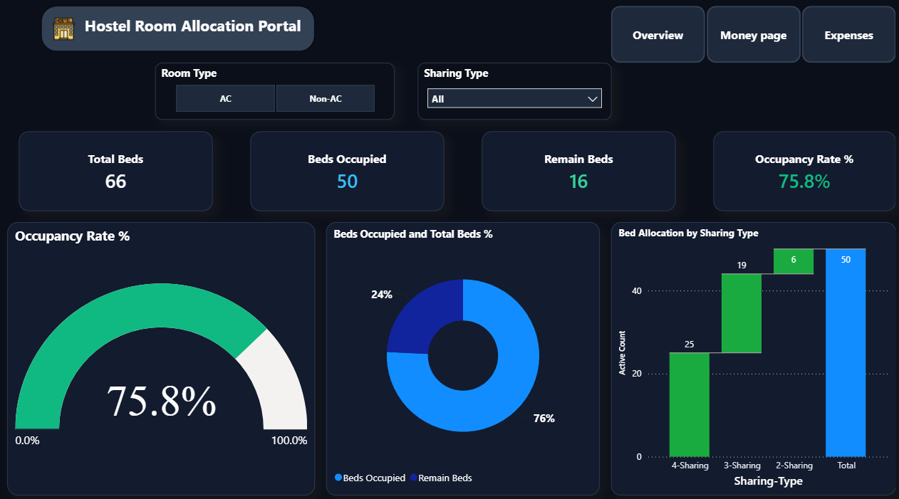
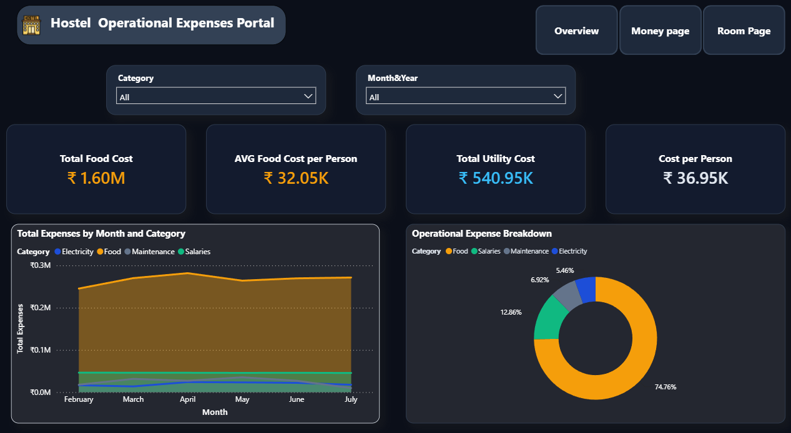

# 🏨 Hostel Operations & Executive Performance Analytics

An executive-grade, 4-page Power BI business intelligence suite built to streamline residential housing operations. This solution bridges financial health, space utilization, and procurement overhead into a single source of truth—empowering administrators and facility managers to eliminate revenue leakage, manage bed capacity, and uncover critical cost drivers.

---

## 📸 Executive Overview



---

## 🎯 Business Problem & Key Findings

Operating residential accommodations requires balancing bed capacity against escalating daily expenses. Analysis of 6 months of operational data revealed critical patterns:

* **Severe Food Subsidy Deficit:** Dining operations represent **74.76% (₹1.60M)** of all operational costs, pushing net margin to **-26.3%**. Current rent pricing heavily subsidizes dining procurement.
* **Under-Utilized Capacity:** The facility runs at a **75.8% overall occupancy rate** with **16 vacant beds** (primarily in higher-tier 2-sharing rooms), leaving potential recurring revenue on the table.
* **Collection Defaulter Exposure:** Identified **20 active rent defaulters** contributing to substantial overdue receivables across the 6-month evaluation cycle.

---

## 📊 Analytical Portals

### 1. Executive Operations Hub
The top-level cockpit designed for owners and executives, consolidating core operational KPIs, monthly revenue-vs-cost trajectories, bed allocations, and high-impact operational flags.
* **Key Metrics:** ₹1.70M Collected, ₹2.14M Expenses, 75.8% Occupancy, 20 Defaulters.

### 2. Financial Operations Portal

Granular breakdown of monthly cash cycles, payment status distributions (Paid, Partially Paid, Unpaid), and overdue tenant ledgers to enforce timely collections.

### 3. Room Allocation & Capacity Portal

Real-time physical asset tracking across AC vs. Non-AC accommodations, comparing active occupancy against total capacity using custom speedometer gauges, donut distributions, and bed allocation steps.

### 4. Operational Expenses & Mess Spend Portal

Detailed cost accounting across four functional categories: **Food Supplies, Staff Salaries, Electricity, and Facility Maintenance**—tracking monthly run rates and per-capita expense metrics.

---

## 🏗️ Data Architecture & Modeling

The project employs an optimized **Star Schema** data model, enforcing strict 1-to-many (`1:*`) relationships with unidirectional cross-filtering for maximum DAX query performance.


### Schema Inventory
* **Fact Tables:** 
  * `Fact_Rent`: Individual monthly tenant collection ledgers, due dates, and settlement status.
  * `Fact_Expenses`: Categorized operating expenditures across mess, maintenance, and utilities.
  * `Fact_Mess_Attendance`: Daily resident dining logs tracking per-meal consumption patterns.
* **Dimension Tables:**
  * `Dim_Members`: Resident demographic data, join dates, and active lease statuses.
  * `Dim_Rooms`: Master room registry, tier classifications (AC / Non-AC), and sharing configurations.
  * `Dim_Month`: Central date dimension table powering uniform time-intelligence filtering.

---

                  ┌──────────────┐
                  │  Dim_Month   │
                  └──────┬───────┘
                         │ 1
                         │
                         │ *
                  ┌──────┴───────┐
      ┌───────────┤  Fact_Rent   ├───────────┐
      │ *         └──────────────┘         * │
      │ 1                                  1 │
┌─────┴───────┐                      ┌───────┴──────┐
│ Dim_Members │                      │  Dim_Rooms   │
└─────┬───────┘                      └───────┬──────┘
      │ 1                                  1 │
      │ *                                  * │
      │ *         ┌──────────────┐         * │
      └───────────┤Fact_Expenses ├───────────┘
                  └──────────────┘
                         │ *
                         │
                         │ 1
             ┌───────────┴──────────┐
             │Fact_Mess_Attendance  │
             └──────────────────────┘

## 🧮 Core DAX Calculations

```dax
// Dynamic Space Utilization Rate
Occupancy Rate % = 
DIVIDE(
    [Beds Occupied], 
    SUM(Dim_Rooms[Total_Beds]), 
    0
)

// Operational Net Profit Margin
Net Margin % = 
DIVIDE(
    [Total Rent Collected] - [Total Expenses], 
    [Total Rent Collected], 
    0
)

// Active Rent Defaulters Count
Defaulters = 
CALCULATE(
    DISTINCTCOUNT(Fact_Rent[Member_ID]),
    Fact_Rent[Payment_Status] = "Unpaid" || Fact_Rent[Payment_Status] = "Partially Paid"
)

// Per-Capita Food Cost Run Rate
AVG Food Cost per Person = 
DIVIDE(
    CALCULATE(SUM(Fact_Expenses[Amount]), Fact_Expenses[Category] = "Food"),
    [Beds Occupied],
    0
)

🎨 UI/UX Design System
Theme: Professional Deep Dark Mode (#0B0F19 canvas, #131B2E component containers).

Grid Hierarchy: Standardized 1400 × 850 px layout with 8px corner radiuses and zero neumorphic distortion.

Semantic Palette:

🟢 Emerald (#10B981): Inflow / Occupancy positive benchmarks

🟠 Amber (#F59E0B): Operating costs and mess/food expenditure

🔴 Crimson (#EF4444): Financial deficits and overdue tenant flags

🔵 Cyan (#38BDF8): Bed inventory and space allocations
